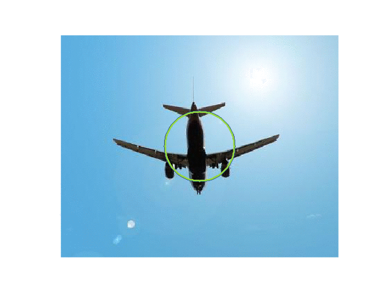
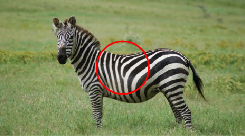

# Active_contours

## Vector-valued active contours for image segmentation

This repository shows an approach for multichannel image segmentation using the vector-valued version of active contours.

